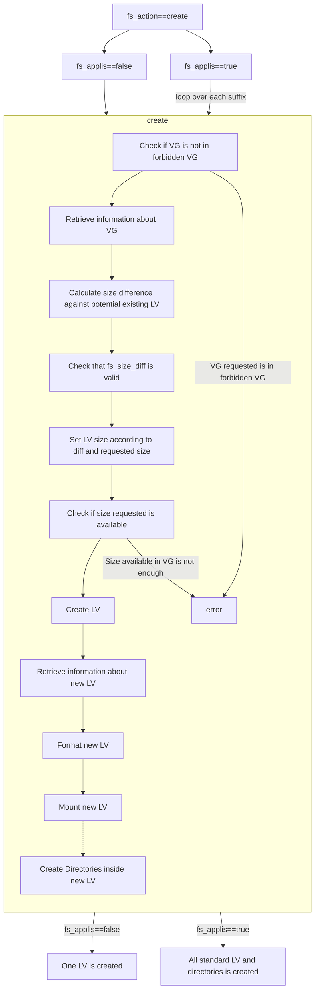
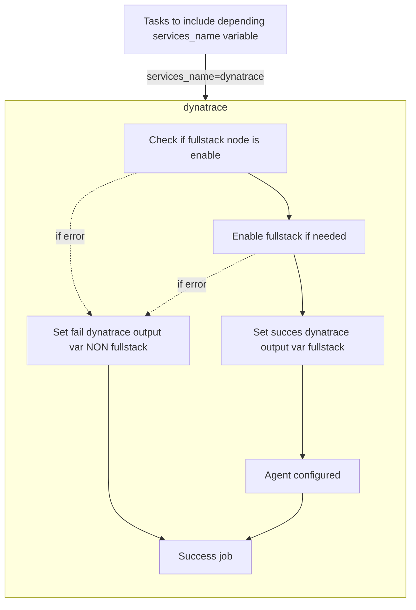
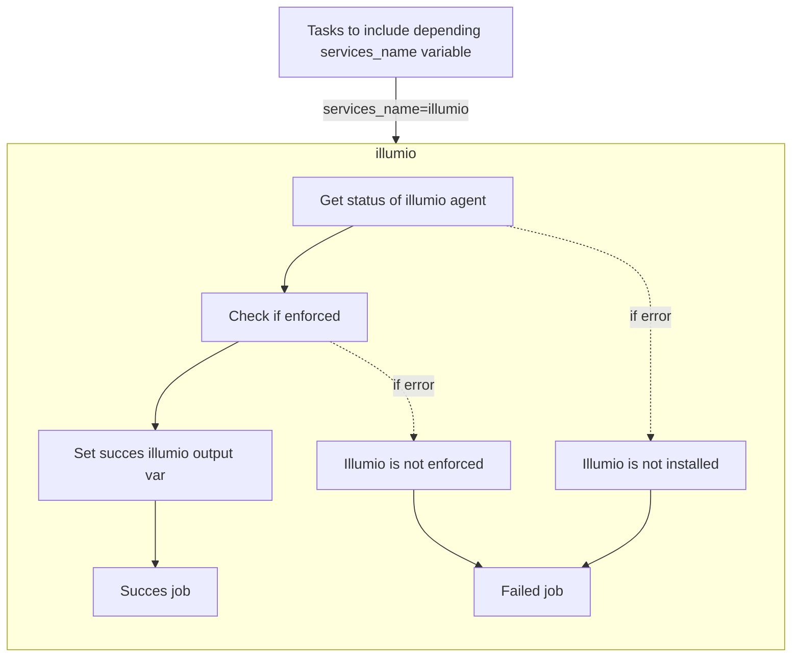
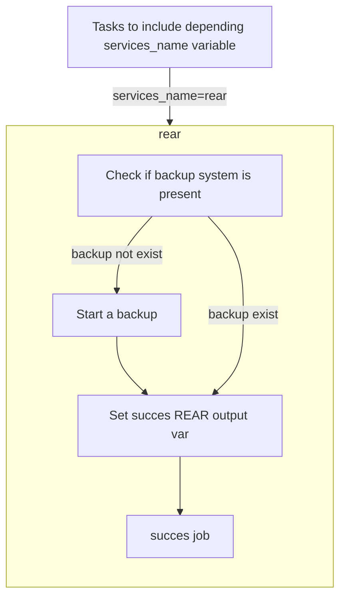
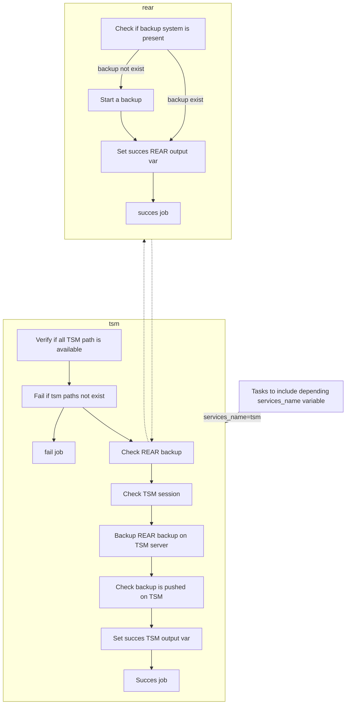
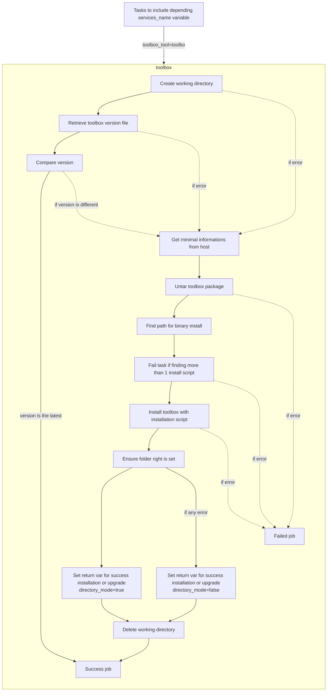
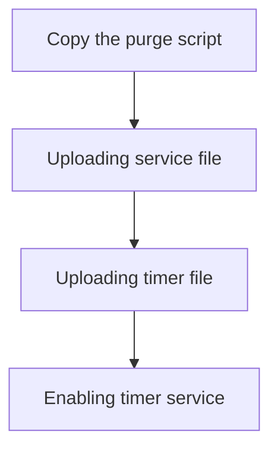

[[_TOC_]]

# OS
This collection include actions to modify Operating System (specially RHEL)

## fs
This role can:
- create/extend a filesystem
- create/extend the standard filesystem for application in VG_apps

Defaults right on folder and mountpoint is:
- user: root
- group: root
- mode: 0750

_**The VG "vg_root" is forbidden for any modification or adding a new LV**_

### Required role variables
- fs_action (limited choices): action to do
    - "create"
- fs_applis (bool): true or false

#### Required var for fs_apps=false
- fs_lv_name: name of lv to create is mandatory
- fs_mount_point: path to the mount point is mandatory
- fs_vgname: vg to use for lv creation is mandatory

#### Required var for fs_apps=true
- fs_apcode: name of lv to create is mandatory
- fs_code5car: path to the mount point is mandatory


### Not required role variables
#### fs_applis=false
- fs_mount_options (str): option to the mount point
    - "rw" by default
- fs_mount_type (str): option to the mount point
    - "xfs" by default
- fs_size (int): 1 by default (Unit in G)
- fs_rights (dict)
    - user: "name of user"
    - group: "name of group"
    - mode: "type of mode"

#### fs_applis=true
- fs_suffix (str): suffix for lv name, separated by comma
- fs_rights (dict)
    - user: "name of user"
    - group: "name of group"
    - mode: "type of mode"
- fs_applis_size: size of all LV in VG_APPS
    - by default (Unit in G):
        - apps: 1 (==> /applis/{{ codeAP }}-{{ code5car }}-{{ id }}/)
        - apps_ti: 1 (==> /applis/{{ codeAP }}-{{ code5car }}-{{ id }}/transfer/in/)  
          _This is an optional FS. Set size to 0 to skip its creation_
        - apps_to: 1 (==> /applis/{{ codeAP }}-{{ code5car }}-{{ id }}/transfer/out/)  
          _This is an optional FS. Set size to 0 to skip its creation_
        - apps_tmp: 1 (==> /applis/{{ codeAP }}-{{ code5car }}-{{ id }}/tmp/)
        - apps_arch: 1 (==> /applis/{{ codeAP }}-{{ code5car }}-{{ id }}/archives/)
        - shared: 1 (==> /applis/shared/)
        - shared_tmp: 1 (==> /applis/shared/tmp/)
        - shared_arch: 1 (==> /applis/shared/archives/)
        - log_apps: 1 (==> /applis/logs/{{ codeAP }}-{{ code5car }}-{{ id }}/)
        - log_shared: 1 (==> /applis/logs/shared/)
        - div_apps: 2 (==> /applis/delivery/{{ codeAP }}-{{ code5car }}-{{ id }}/)
        - div_shared: 2 (==> /applis/delivery/shared/)

### How to call role
#### Create a simple FS
A new LV "my_lv_name" will be created on VG "vg_apps" with a size of 1G and mounted on "/applis/my_mount_point".  
FS will be formated with XFS file system and mounted with "rw" options.  
Mount "/applis/my_mount_point" will have root as user proprietary, root as group proprietary and "0700" as folder access.
```yaml
    - name: Create fs for application
      ansible.builtin.include_role:
        name: bnp_frb.os.fs
      vars:
        fs_action: "create"
        fs_applis: false
        fs_lv_name: "my_lv_name"
        fs_mount_point: "/applis/my_mount_point"
```
#### Create/extend a complexe FS
A new LV "my_lv_name" will be created on VG "vg_apps" with a size of 3G and mounted on "/applis/my_mount_point".  
FS will be formated with EXT4 file system and mounted with "rw,noauto" options.  
Mount "/applis/my_mount_point" will have "user_app" as user proprietary, "group_app" as group proprietary and "0750" as folder access.
If the LV already exists and its size is inferior to 3G, it will be extended to a 3G.
```yaml
    - name: Create fs for application
      ansible.builtin.include_role:
        name: bnp_frb.os.fs
      vars:
        fs_action: "create"
        fs_applis: false
        fs_lv_name: "my_lv_name"
        fs_mount_point: "/applis/my_mount_point"
        fs_vgname: "vg_apps"
        fs_size: 3
        fs_mount_options: "rw,noauto"
        fs_mount_type: "ext4"
        fs_rights:
          user: "user_app"
          group: "group_app"
          mode: "0750"
```
#### Create middleware FS with default options
All middleware mount point and directory will be created on VG "vg_apps" with default size (see above) and mounted on there default mount point.  
FS will be formated with XFS file system and mounted with "defaults" options.  
All mountpoint and directories will have root as user proprietary, root as group proprietary and "750" as folder access.
```yaml
    - name: Create fs for application
      ansible.builtin.include_role:
        name: bnp_frb.os.fs
      vars:
        fs_action: "create"
        fs_applis: true
        fs_apcode: "APxxxx"
        fs_code5car: "xxxxx"
```

#### Create middleware FS with all options
All middleware mount point and directory will be created on VG "vg_apps" with size options and mounted on there default mount point.  
LV will be create with 2 suffix ==> lv-xxxxx-xxxxx-01, lv-xxxxx-xxxxx-02, etc....  
_**Keep in mind the size declared will be apply to all suffix declination.**_ (ie: in this example, 2 suffixs ==> 50G for lv-xxxxx-xxxxx-01, 50G for lv-xxxxx-xxxxx-02, etc...)  
FS will be formated with XFS file system and mounted with "rw" options.  
All mountpoint and directories will have "user_app" as user proprietary, "group_app" as group proprietary and "0750" as folder access.
```yaml
    - name: Create fs for application
      ansible.builtin.include_role:
        name: bnp_frb.os.fs
      vars:
        fs_action: "create"
        fs_applis: true
        fs_apcode: "APxxxx"
        fs_code5car: "xxxxx"
        fs_suffix: "01,02"
        fs_rights:
          user: "user_app"
          group: "group_app"
          mode: "0750"
        fs_size: size of all LV in VG_APPS
          apps: 50
          apps_ti: 2
          apps_to: 2
          apps_tmp: 1
          apps_arch: 10
          shared: 10
          shared_tmp: 1
          shared_arch: 1
          log_apps: 2
          log_shared: 1
          div_apps: 15
          div_shared: 2
```

**VG size available will be checked before each LV creation. So if you have a VG with 80G free, first LV will be created, but the second one put this role in failed state.**

### Technical documentation
#### Prerequisite
- Collection community.general >= 5.3.0

#### Schema


#### fs/defaults
##### main.yml
* fs_size: default size for a new single FS ==> 1G
* vg_forbidden: List of VG forbidden to use ==> vg_root
* fs_mount_options: default option for mount ==> rw
* fs_mount_type: default type of FS ==> xfs
* fs_prefix: prefix before each new LV name ==> lv_
* fs_lv: dict to use in standard lv applications
    * root_mount: root directory for mount point ==> applis
    * name: contructed name of LV
* fs_apps_size_defaults: default size for all standard LV for applications
    - apps: 1 (==> /applis/{{ codeAP }}-{{ code5car }}-{{ id }}/)
    - apps_ti: 1 (==> /applis/{{ codeAP }}-{{ code5car }}-{{ id }}/transfer/in/)
    - apps_to: 1 (==> /applis/{{ codeAP }}-{{ code5car }}-{{ id }}/transfer/out/)
    - apps_tmp: 1 (==> /applis/{{ codeAP }}-{{ code5car }}-{{ id }}/tmp/)
    - apps_arch: 1 (==> /applis/{{ codeAP }}-{{ code5car }}-{{ id }}/archives/)
    - shared: 1 (==> /applis/shared/)
    - shared_tmp: 1 (==> /applis/shared/tmp/)
    - shared_arch: 1 (==> /applis/shared/archives/)
    - log_apps: 1 (==> /applis/logs/{{ codeAP }}-{{ code5car }}-{{ id }}/)
    - log_shared: 1 (==> /applis/logs/shared/)
    - div_apps: 2 (==> /applis/delivery/{{ codeAP }}-{{ code5car }}-{{ id }}/)
    - div_shared: 2 (==> /applis/delivery/shared/)
* fs_apps_defaults_right: dict of default right to apply on directories and mount points
    * user: default "root"
    * group: default "root"
    * mode: default "0700"

#### fs/tasks
##### main.yml
1. Tasks to include depending fs_action

##### create/main.yml
1. Create one LV
1. Create all standard LV

##### create/standalone.yml
1. Control if the VG used is not in forbidden list
1. Get informations about VG to used
    1. infos/vg.yml
1. Calculate size difference against potential existing LV
1. Check that fs_size_diff is valid
1. Set LV size according to diff and requested size
1. Control if size requested is available
1. Create new LV
1. Get informations about new LV previously created
1. Format new LV
1. Mount new LV
1. Try to apply user right on mount point
    - block
        1. Ensure right on mount point
    - rescue
        1. Message for non apply user right
1. Compose dict of created LVs for report for this LV

##### create/standard.yml
1. Validation of prerequisite variables
1. Validate suffixe for LV name
1. Start tasks to create LV and directories with suffix
    1. standard/applis.yml
1. Start tasks to create LV and directories without suffix
    1. standard/applis.yml (fs_lv_suffix is empty)

##### create/standard/applis.yml
1. Create all LV for applications
    1. loop on create/standalone.yml
1. Create all LV for applications
    1. loop on create/standalone.yml
1. Create all directories for applications
    1. loop on create/directory.yml
1. Create all directories for shared
    1. loop on create/directory.yml

##### create/standard/directory.yml
1. Check if directory is already created
1. Create directory
    1. if directory not exist

##### infos/lv.yml
1. Get information about a LV with shell command
1. Transform stdout in yaml dict
1. Set all info lv in var
1. Reduce lv information in a list
1. Set specific lv info in vars

##### infos/vg.yml
1. Get informations about a VG with shell command
1. Transform stdout in yaml dict
1. Set all info vg in var
1. Reduce vg information in a list
1. Set specific lv info in vars

## services
This role will provides action for services offered by OS when delivered by BP²I.  
Services can be:
- All services in systemd
- All core applications pre-installed
  - dynatrace
  - illumio
  - tsm
  - rear

### Services description
#### dynatrace
- Configure dynatrace in fullstack
- No failure if dynatrace cannot be configure but error is reported

#### illumio
- Check if illumio is enforced.
- Failed if illumio is not enforced

#### rear
- Check if backup system is present
  - If not, start a local backup system

#### tsm
- Check if all TSM artifacts is present
  - failed if one or more is not present
- Start a backup of REAR backup system


### Required role variables
- services_name (limited choices): 
    - "dynatrace"
    - "illumio"
    - "tsm"
    - "rear"

### Returned role variables
#### dynatrace
return a dict only if success  
##### fullstack enable
```yaml
services_dynatrace:
  output: "Dynatrace for {{ inventory_hostname }} successfully configured"
  fullstack: true
```
##### Config failure
```yaml
services_dynatrace:
  output: "Dynatrace for {{ inventory_hostname }} configuration failed"
  fullstack: false
```

#### illumio
return a dict only if success  
```yaml
services_illumio:
  output: "Illumio for {{ inventory_hostname }} successfully enforced"
  enforced: true
```

#### tsm
return a dict only if success  
```yaml
services_tsm:
  output: "TSM backup for {{ inventory_hostname }} successfully"
  created: true
```

#### rear
##### backup is created
return a dict only if success  
```yaml
services_rear:
  output: "REAR backup for {{ inventory_hostname }} successfully created"
  created: true
  present: true
```

##### backup is not created
```yaml
services_rear:
  output: "REAR backup for {{ inventory_hostname }} already exist"
  created: false
  present: true
```

### How to call role
#### dynatrace
dynatrace will be configured in fullstack depending presence of oracle user and database RDBMS
```yaml
- name: Configure dynatrace
  ansible.builtin.include_role:
    name: bnp_frb.os.services
  vars:
    services_name: "dynatrace"
```
#### illumio
```yaml
- name: Check illumio
  ansible.builtin.include_role:
    name: bnp_frb.os.services
  vars:
    services_name: "illumio"
```

#### tsm
```yaml
- name: Check and start backup system
  ansible.builtin.include_role:
    name: bnp_frb.os.services
  vars:
    services_name: "tsm"
```

#### rear
```yaml
- name: Check or start rear backup system
  ansible.builtin.include_role:
    name: bnp_frb.os.services
  vars:
    services_name: "rear"
```

### Technical documentation
#### Schemas
##### Dynatrace


##### Illumio


##### rear


##### TSM


#### main.yml
1. Tasks to include depending services_name variable

#### dynatrace/main.yml
1. Enable dynatrace fullstack option
  - block
    1. Create dict for every option version
    1. Detect dynatrace existing version 
    1. Set dynatrace options to choose
    1. Check fullstack status
    1. Enable fullstack
    1. Set succes dynatrace output var fullstack
  - rescue
    1. Set fail dynatrace output var NON fullstack

#### illumio/main.yml
1. Check status of illumio if present
  - block
    1. Get status of illumio agent
    1. Check if enforced
    1. Fail if not enforced
    1. Set succes illumio output var
  - rescue
    1. Illumio is not installed
      - message for the fail task
    1. Illumio is not enforced
      - message for the fail task

#### rear/main.yml
1. Check if backup system is present
1. Start a backup if not exist
1. Set succes REAR output var if backup is already exist
1. Set succes REAR output var if backup is just created

#### tsm/main.yml
1. Verify if all TSM path is available
1. Fail if tsm paths not exist
1. Check REAR backup and start if not exist
  - include rear/main.yml (see above)
1. Check TSM session
1. Backup REAR backup on TSM server
1. Check backup is pushed on TSM
1. Set succes TSM output var

## toolbox
This role use tools in toolbox.
- install or update toolbox


### Required role variables
- toolbox_tool (str): choices in list
    - toolbox

### Returned role variables
#### Toolbox
return a dict
##### if all success  
```yaml
toolbox_result:
  output: "Toolbox installation/upgrade for {{ inventory_hostname }} successfully."
  installation: true
  directory_mode: true
```

##### if some users is not present to set directory mode
```yaml
toolbox_result:
  output: "Toolbox installation/upgrade for {{ inventory_hostname }} successfully but some users is not present."
  installation: true
  directory_mode: false
```

### How to call role
#### Toolbox
```yaml
- name: Role toolbox
  ansible.builtin.include_role:
    name: bnp_frb.os.toolbox
  vars:
    toolbox_tool: "toolbox"
```

### Technical documentation
#### Schemas
##### Toolbox


#### main.yml
1. Tasks to include depending toolbox_tool variable

#### toolbox/main.yml
1. Create working directory
1. Install toolbox if not present or not in latest version
  - block
    1. Retrieve toolbox version file
    1. Set actual version and latest version of toolbox
    1. Fail if actual version is not the latest
  - rescue
    1. Get minimal informations from host
    1. Untar toolbox package
    1. Find path for binary install
    1. Fail task if finding more than 1 install script
    1. Install toolbox with installation script
1. Apply Directory right and mode if user exist
    - block
        1. Ensure folder right is set
        1. Set return var for success installation or upgrade
    - rescue
        1. Set return var for success installation or upgrade but some user not exist
1. Delete working directory


## logs
This role can:
- install a service to ensure logs will be purged every 30 days

### Required role variables
- logs_action (limited choices): action to do
    - purge

### How to call role
```yaml
- name: Create the service which ensure purge is launched every 30 days
  ansible.builtin.include_role:
    name: bnp_frb.os.logs
  vars:
    logs_action: "purge"
```

### Technical documentation
#### Schema



#### logs/defaults
##### main.yml
Dictionnary with defaults paths and conf

#### logs/files
- purge_logs.service ==> service file
- purge_logs.timer ==> timer service file

#### logs/tasks
##### main.yml
1. Tasks to include depending logs_action

##### logs/tasks/purge/
###### main.yml
1. Copy the purge script into toolbox exploit
1. Uploading service file for purge
1. Uploading timer service file for purge
1. Enabling timer service

#### logs/templates
##### purgelogs_launcher.sh.j2
Template for shell script which will be used in timer service

