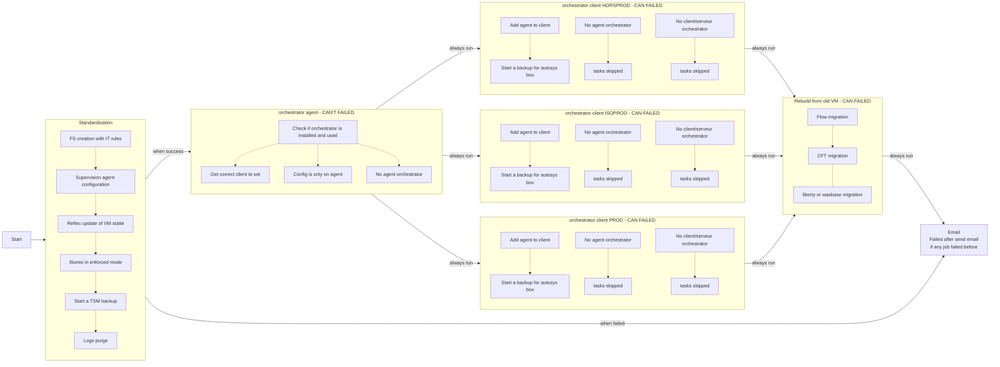

[[_TOC_]]

# workflow-AAP-vm_standard
Workflow AAP for VM standardization configure VM with:
- FS creation with IT rules
- Supervision agent configuration
- Reftec update of VM state
- Illumio in "enforced" mode
- Start a TSM backup
- Logs purge
- Orchestrator agent configuration
- Add the new VM to an existing VIP

Workflow AAP could be used to transfer configuration between old VM to the new one alreday standardized:
- Flow migration (Not fully fonctionnal)
- LibertyCore et Wasbase migration (Under development)
- CFT migration (DEV finished, under testing)

Documentation for each playbook which construct this workflow:
- [standardisation.yml](https://gitlab-dogen.group.echonet/market-place/ap26167/production-as-code-projects/workflow-aap-vm_standard/-/blob/main/standardisation/README.md)
- [orchestrator.yml](https://gitlab-dogen.group.echonet/market-place/ap26167/production-as-code-projects/workflow-aap-vm_standard/-/blob/main/orchestrator/README.md)
- [rebuild.yml](https://gitlab-dogen.group.echonet/market-place/ap26167/production-as-code-projects/workflow-aap-vm_standard/-/blob/main/rebuild/README.md)
- [email.yml](https://gitlab-dogen.group.echonet/market-place/ap26167/production-as-code-projects/workflow-aap-vm_standard/-/blob/main/email/README.md)

## Schemas

