# SHA-Toolbox - Workflow Diagram

```mermaid
flowchart TD
    A([Start SHA-Toolbox Playbook]) --> B{SystemD Check}
    B -->|Running| C[Validate CodeAP & Code5car]
    B -->|Not Running| ERR1[Error: SystemD Not Available]
    
    C --> D{CodeAP Valid?<br/>5-6 digits}
    D -->|Yes| E{Code5car Valid?<br/>5 alphanumeric or<br/>trigram+00}
    D -->|No| ERR2[Error: Invalid CodeAP]
    
    E -->|Yes| F[Gather Host Facts]
    E -->|No| ERR3[Error: Invalid Code5car]
    
    F --> G[ips_toolbox_banner Role]
    
    G --> H[Detect OS Type<br/>Linux/Windows]
    H --> I[Get Serial Number]
    I --> J[Create Pre-Login Banner<br/>/etc/issue.net]
    J --> K[Create Post-Login Banner<br/>/etc/motd]
    K --> L[Clean User Prompt<br/>Remove ANSI codes]
    
    L --> M[ips_toolbox_users Role]
    M --> N[Create Technical Users<br/>Based on Middleware]
    
    N --> O[app_environment_builder Role<br/>Detect Middleware]
    
    O --> P[Real Server Scan<br/>Not Fixed List]
    P --> Q{CFT Detected?}
    Q -->|Yes| R[Configure CFT<br/>Create CFT User]
    Q -->|No| T
    
    R --> S[Get CFT Version]
    S --> T{MQ Detected?}
    
    T -->|Yes| U[Configure MQ<br/>Create MQ User]
    T -->|No| W
    
    U --> V[Get MQ Version]
    V --> W{SQL Server<br/>Detected?}
    
    W -->|Yes| X[Configure SQL Server<br/>Create SQL User]
    W -->|No| Z
    
    X --> Y[Get SQL Server Version]
    Y --> Z{WebSphere<br/>Detected?}
    
    Z -->|Yes| AA{WAS Type?}
    Z -->|No| AF
    
    AA -->|Base| AB[Configure WAS Base<br/>Create Wasbase User]
    AA -->|ND| AC[Configure WAS ND<br/>Create WasND User]
    AA -->|Liberty Core| AD[Configure Liberty Core<br/>Create LibertyCore User]
    AA -->|Liberty Base| AE[Configure Liberty Base<br/>Create LibertyBase User]
    
    AB --> AG[Use websphere_manager.py<br/>GitHub Integration]
    AC --> AG
    AD --> AG
    AE --> AG
    
    AG --> AH[Get WebSphere Version]
    AH --> AF{IHS Detected?}
    
    AF -->|Yes| AI[Configure IHS<br/>Create IHS User]
    AF -->|No| AK
    
    AI --> AJ[Get IHS Version]
    AJ --> AK{JVM Detected?}
    
    AK -->|Yes| AL[Configure JVM<br/>Create JVM User]
    AK -->|No| AN
    
    AL --> AM[Get JVM Version]
    AM --> AN[ips_toolbox_toolboxes Role]
    
    AN --> AO[Install/Update Toolboxes]
    AO --> AP[ips_toolbox_system Role]
    
    AP --> AQ{Create Filesystems}
    AQ --> AR[Create /applis]
    AQ --> AS[Create /apps]
    
    AR --> AT[Configure NTP]
    AS --> AT
    
    AT --> AU[ips_toolbox_dynatrace Role]
    
    AU --> AV{Dynatrace<br/>OneAgent?}
    AV -->|Installed| AW[Get OneAgent Status<br/>& Monitoring Mode]
    AV -->|Not Installed| AZ
    
    AW --> AX[Display Dynatrace Info]
    AX --> AZ[ips_toolbox_illumio Role]
    
    AZ --> BA{Illumio VEN?}
    BA -->|Installed| BB[Get VEN Status,<br/>Enforcement Mode,<br/>PCE Connectivity]
    BA -->|Not Installed| BE
    
    BB --> BC[Use connectivity-test-j<br/>Command]
    BC --> BD[Display Illumio Info]
    BD --> BE[ips_toolbox_backup Role]
    
    BE --> BF{Netbackup<br/>Detected?}
    
    BF -->|Yes| BG[Configure Netbackup]
    BF -->|No| BH{TSM<br/>Available?}
    
    BG --> BL
    
    BH -->|Yes| BI[Configure TSM<br/>Conditional Trigger]
    BH -->|No| BL[Backup Configuration Complete]
    
    BI --> BJ[Use Correct TSM Paths]
    BJ --> BK[Get TSM Status]
    BK --> BM[Display TSM Info]
    BM --> BL
    
    BL --> BN[ips_toolbox_logs Role]
    
    BN --> BO{Configure<br/>Log Purge?}
    BO -->|Yes| BP[Get Days from Survey Input]
    BO -->|No| BS
    
    BP --> BQ[Create SystemD Timer<br/>Execute at 01:00]
    BQ --> BR[Display Log Purge Summary]
    BR --> BS[report_generator Role]
    
    BS --> BT[Organize Summary by Themes]
    BT --> BU[Include Middleware Versions]
    BU --> BV[Include Dynatrace,<br/>Illumio, TSM Status]
    BV --> BW[Generate Final Report]
    
    BW --> BX([Execution Complete])
    
    ERR1 --> ERR[Playbook Failed]
    ERR2 --> ERR
    ERR3 --> ERR
    
    style A fill:#90EE90
    style BX fill:#90EE90
    style ERR fill:#FFB6C1
    style ERR1 fill:#FFB6C1
    style ERR2 fill:#FFB6C1
    style ERR3 fill:#FFB6C1
    style O fill:#87CEEB
    style G fill:#FFD700
    style M fill:#FFD700
    style AU fill:#DDA0DD
    style AZ fill:#DDA0DD
    style BE fill:#F0E68C
    style BN fill:#F0E68C
    style BS fill:#98FB98
```

## Workflow Description

### Phase 1: Validation & Initialization
1. **SystemD Check**: Verify SystemD is running
2. **Code Validation**: Validate CodeAP (5-6 digits) and Code5car (5 alphanumeric or trigram+00)
3. **Gather Facts**: Collect host information

### Phase 2: Banner Configuration
1. Detect OS type (Linux/Windows)
2. Get system Serial Number
3. Create pre-login banner (`/etc/issue.net`)
4. Create post-login banner (`/etc/motd`) with middleware versions
5. Clean user prompt (remove ANSI codes, ensure ends with `$`)

### Phase 3: Middleware Detection & Configuration
1. **Real Server Scan**: Dynamic detection (not fixed list)
2. **Middleware-Specific Detection**:
   - CFT: Configure & create CFT user
   - MQ: Configure & create MQ user
   - SQL Server: Configure & create SQL user
   - WebSphere (Base/ND/Liberty): Use `websphere_manager.py` from GitHub
   - IHS: Configure & create IHS user
   - JVM: Configure & create JVM user
3. **Version Extraction**: Get version for each detected middleware

### Phase 4: Toolbox & System Setup
1. Install/update toolboxes
2. Create filesystems (`/applis`, `/apps`)
3. Configure NTP

### Phase 5: Service Integration
1. **Dynatrace**: Get OneAgent status and monitoring mode
2. **Illumio**: Get VEN status, enforcement mode, PCE connectivity (using `connectivity-test-j`)
3. **Backup Systems**:
   - Check Netbackup first
   - If Netbackup not detected, configure TSM (conditional)
   - Use correct TSM paths

### Phase 6: Log Management
1. Configure log purge timer
2. Use Survey input for days specification
3. Schedule execution at 01:00 via SystemD timer

### Phase 7: Reporting
1. Organize summary by themes
2. Include all detected middleware versions
3. Include Dynatrace, Illumio, TSM status
4. Generate final execution report

## Key Features
- **Real-time Detection**: Middleware detection via actual server scanning
- **Conditional Logic**: TSM only if Netbackup not present
- **Dynamic User Creation**: Technical users created based on detected middleware
- **Version Tracking**: All middleware versions captured and displayed
- **Survey Integration**: Log purge days from AAP2 Survey input
- **Comprehensive Reporting**: Organized by themes with all service status
